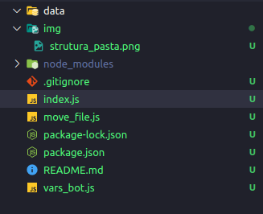

# Demo - Bot que captura os cursos concluidos da udemy

# contextualização
 
 - Objetivo: Listar todos os meus cursos concluido e aqueles prestes a concluir
 - Problema: A api da udemy não possui na sua documentação nenhum descretivo para listar os "meus cursos e seus detalhes"
 - solução:
    - Depois de logar analisei todas as request na lista dos meus cursos: https://www.udemy.com/home/my-courses/learning/
    - Encontrei as seguintes url : "next":"https://www.udemy.com/api-2.0/users/me/subscribed-courses/?fields%5Bcourse%5D=%40min%2Cvisible_instructors%2Cimage_240x135%2Cfavorite_time%2Carchive_time%2Ccompletion_ratio%2Clast_accessed_time%2Cenrollment_time%2Cis_practice_test_course%2Cfeatures%2Cnum_collections%2Cpublished_title%2Cis_private%2Cbuyable_object_type&fields%5Buser%5D=%40min%2Cjob_title&ordering=-last_accessed&page=2&page_size=12"
     e aplicando os filtros disponiveis :
    "https://www.udemy.com/api-2.0/users/me/subscribed-courses/?ordering=-last_accessed&fields[course]=@min,visible_instructors,image_240x135,favorite_time,archive_time,completion_ratio,last_accessed_time,enrollment_time,is_practice_test_course,features,num_collections,published_title,is_private,buyable_object_type&fields[user]=@min,job_title&page=1&page_size=12&max_progress=99.9&min_progress=0.1"

        dois query que retorna um json contendo a lista atual dos cursos e os detalhes na tela e com um campo "count" que deduzindo pelos meus testes é o resultado da query de solicitação assim ele é usado para calcular a lista apresentada atualmente na tela e qual sera a proxima lista.
    - Estudando os parametros das querys... as variaveis que me interessa "page_size" define a quantidade de cursos serão apresentados (uma especie de top), "page_size" a quantidade de elementos por paginas, "completion_ratio" o filtro de status do curso e as variaveis de intevalos(range) "max_progress" e "min_progres"
    - "Sequestro de sessão" :smirk:, depois de obter a url e seus parametros precisamos do token de autenticação
    cada request da udemy pede um token "Beare"  no header 
    abrindo os cookies do site tem a informação do token em "access_token" com o token e a url é hora de automatizar 

    - Selenium web drive. Com o selenium entraremos em nossa conta para obter o token gerado 
    - axios com o token em mãos vamos fazer a request com a lista compla de todos os cursos em uma unica request

# Resumo do script

- abre uma instancia do navegador firefox 
- cria uma sessao 
- captura os cookies de sessao
- por fim efetua uma request para capturar o json contendo toda a lista de curso com status de 80% a 100% concluido

# Estrutra de pastas

# uso

- Execute a instalação dos pacotes no diretorio da index.js
    - npm i
- Coloque seu usuario e senha da udemy no arquivo vars_bot.js
